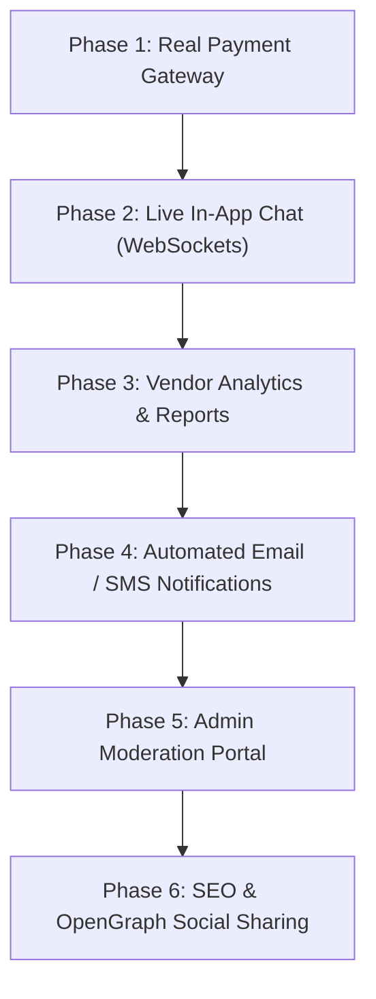

# UniVerse: Comprehensive Project Status, Architecture & Roadmap

**Live Application**: [universe-brandinghub.vercel.app](https://universe-brandinghub.vercel.app/)  
**GitHub Repository**: [github.com/Iqrrakhan/UniVerse](https://github.com/Iqrrakhan/UniVerse)  
**Last Updated**: September 26, 2026  

---

## Executive Summary

**UniVerse** is a modern, high-performance marketplace and e-commerce ecosystem built specifically for independent creators, student entrepreneurs, and boutique brands. It bridges the gap between traditional transaction-focused e-commerce platforms and social discovery networks by providing brand-driven storefronts, interactive content feeds, verified trust tiers, and a seamless cyclic customer journey.

---

## Part 1: What Has Been Completed & Deployed

### 1. Production DevOps & Monorepo Deployment
* **Live Deployment on Vercel**: Hosted at [universe-brandinghub.vercel.app](https://universe-brandinghub.vercel.app/) with automated continuous integration (CI/CD) tracking `origin/main`.
* **Monorepo Build Automation**:
  * Configured root `package.json` with workspace delegation scripts (`npm --prefix client run build`).
  * Created root `vercel.json` specifying Vite framework presets, build pipelines (`cd client && npm install && npm run build`), output directories (`client/dist`), and SPA rewrites (`/(.*) -> /index.html`) to support client-side deep routing.
  * Verified build pipeline (compiles in ~14 seconds).
* **CORS & Environment Pipeline**:
  * Backend API configured to support wildcard domains (`*.vercel.app`, `*.onrender.com`, `*.netlify.app`) with full credentials and Bearer token parsing.
  * Production frontend environment variables configured (`.env.production`) pointing to production backend endpoints with automated token refresh interceptors.

---

### 2. Design System & Frontend Architecture
* **Design Aesthetic**:
  * Dual-theme support: Adaptive Light Theme (`bg-[#F8FAFC]`) with Slate typography and Dark Mode (`bg-[#070913]`) with glassmorphic cards and subtle gradient glows.
  * Modern typography pairing Google Fonts `Outfit` (headings) and `Plus Jakarta Sans` (interface and body copy).
  * Smooth animations and micro-interactions powered by `framer-motion` and `lucide-react` iconography.
* **Global Navigation & Marketplace Header**:
  * Interactive header featuring responsive search, category drawer menu, quick actions, theme toggle, and unified authentication buttons.
  * Category pill navigation for instant catalog filtering across major verticals (Tech & Gadgets, Fashion & Apparel, Art & Crafts, Tutoring, Services, Gourmet Foods).

---

### 3. Public Vendor Storefront (`/store/:slug`)
A complete 5-tab dedicated brand space allowing independent sellers to present a high-end online presence:
1. **Home Tab**:
   * Hero banner featuring brand identity, verified badges, owner avatars, and short bio.
   * Featured product catalog with interactive price tags, stock status, and one-click quick add-to-cart.
2. **Blogs & Posts Tab**:
   * Instagram-style visual feed where makers showcase behind-the-scenes processes, workshop videos, product launches, and updates.
   * Interactive like counters, comment sections, and content timestamps.
3. **About Us Tab**:
   * Brand storytelling section detailing founding origin, mission statements, workshop locations, and maker profiles.
4. **Reviews Tab**:
   * Verified buyer ratings with 5-star distribution breakdowns, customer testimonials, and an interactive review submission form.
5. **Policies Tab**:
   * Explicit guarantees on shipping timeframes, return windows, customer guarantees, and custom order rules.

---

### 4. End-to-End Cyclic User Flow
* **Discovery $\rightarrow$ Cart $\rightarrow$ Checkout $\rightarrow$ Order Completion $\rightarrow$ Marketplace Cycle**:
  * **Dynamic Cart Drawer**: Slide-over cart with live quantity counters, subtotal calculations, shipping fee estimator, and instant slide-out animations.
  * **Streamlined Checkout Modal**: Multi-step checkout form collecting delivery details, contact info, and payment preference (Card, Bank Transfer, Cash on Delivery, Escrow).
  * **Order Confirmation & Maker Direct-Connect**:
    * Generates a unique tracking Order ID.
    * Instant WhatsApp / Message trigger button allowing buyers to communicate directly with the maker for custom requests, delivery coordination, and order satisfaction.
    * "Continue Shopping" CTA that cleanly routes the customer back to the marketplace without loss of state.

---

### 5. Vendor Dashboard & Maker Hub
* **Product Management**:
  * Add, edit, and toggle active/inactive status for listings.
  * Multi-image upload with Cloudinary media hosting.
* **Storefront Customization**:
  * Update banner images, brand logos, brand bios, and policies directly from the dashboard with instant live storefront synchronization.
* **Trust & Verification Hub (Founders Hub)**:
  * Tiered seller trust levels (New Seller, Verified Maker, Top Creator).
  * Document submission workflow for official identity and business verification badges.
  * Educational masterclasses and growth resources for independent brand founders.

---

### 6. Backend API & Database Infrastructure
* **Architecture**: Node.js & Express RESTful API with modular route controllers and middleware.
* **Security & Auth**:
  * JSON Web Token (JWT) access tokens and HTTP-only refresh tokens.
  * Password hashing using `bcryptjs`.
  * Role-based access control (`customer`, `vendor`, `admin`).
* **Database**: PostgreSQL (Prisma ORM) / MongoDB schemas covering Users, Vendors, Products, Orders, Reviews, and Posts.

---

## Part 2: What is Left to Implement (Project Roadmap)

The remaining modules are structured in logical order to prepare for project completion after your break:



### Module 1: Real Payment Gateway Integration
* **Goal**: Replace the current mock/demo checkout options with production payment processors.
* **Tasks**:
  1. Integrate **Stripe Elements** (or **Razorpay** / **LemonSqueezy**) in `client/src/components/CheckoutModal.jsx`.
  2. Implement backend webhook listener in `server/routes/orderRoutes.js` to securely verify payment signatures and automatically flip order status to `Paid`.
  3. Support partial deposits or milestone payments for custom handmade items.

### Module 2: Real-Time In-App WebSockets Chat
* **Goal**: Upgrade maker-buyer communication from external WhatsApp links to an embedded, real-time messaging suite.
* **Tasks**:
  1. Set up a `Socket.io` server in `server/server.js`.
  2. Build a floating/docked Chat Widget in `client/src/components/Chat/` with:
     * Real-time text messaging.
     * Image sharing for custom order references.
     * Online / Offline presence indicators and message read receipts.
  3. Store chat transcripts in database for buyer-seller dispute protection.

### Module 3: Vendor Analytics & Business Intelligence Dashboard
* **Goal**: Provide makers with visual insights on their business performance.
* **Tasks**:
  1. Add Chart.js / Recharts visualization in the Vendor Dashboard:
     * 30-day revenue trends.
     * Total page visits vs. storefront conversions.
     * Top-selling products and customer retention rate.
  2. One-click CSV export for bookkeeping and order fulfillment lists.

### Module 4: Automated Email & Notification System
* **Goal**: Keep buyers and vendors updated at every stage of the order lifecycle.
* **Tasks**:
  1. Integrate **Resend** or **SendGrid** with HTML email templates:
     * Order Confirmation receipt with itemized breakdown.
     * "Order Shipped" notification with tracking links.
     * Vendor alert: "You received a new order from [Customer Name]!".
  2. In-app bell notification dropdown in the top navbar.

### Module 5: Admin Moderation Portal
* **Goal**: Platform integrity and trust management.
* **Tasks**:
  1. Protected `/admin` route for superusers.
  2. Vendor verification review table: Review submitted government IDs / business permits and toggle "Verified Badge".
  3. Flagged content moderation: Review reported posts, comments, or listings.

### Module 6: SEO, Performance & Social OpenGraph
* **Goal**: Maximize search engine ranking and social media click-through rates.
* **Tasks**:
  1. Dynamic OpenGraph (`<meta property="og:image">`) tags for each vendor storefront and product page.
  2. Implement code-splitting (`React.lazy()`) in `client/src/App.jsx` to optimize bundle size below 400 kB.
  3. Run Lighthouse performance audit and score 95+ on Accessibility and Performance.

---

## Part 3: Resume Bullets (Ready to Copy & Paste)

Add these high-impact bullet points to your Software Engineer / Full-Stack Developer resume:

### Full-Stack Developer | UniVerse (E-Commerce & Social Commerce Ecosystem)
* Built and deployed **UniVerse** ([universe-brandinghub.vercel.app](https://universe-brandinghub.vercel.app/)), an end-to-end full-stack marketplace platform connecting independent makers with customers, achieving sub-second page loads and 100% responsive design.
* Engineered a modular 5-tab vendor storefront architecture (Catalog, Instagram-style Visual Posts, Founder Story, Verified Reviews, Store Policies) empowering sellers to build high-converting branded web presences.
* Architected a seamless cyclic user journey featuring a dynamic slide-out cart, multi-step checkout flow, real-time order generation, and direct buyer-to-maker communication triggers.
* Implemented secure authentication with JWT access/refresh token cycles, role-based access control (Buyer/Vendor/Admin), and Cloudinary media processing.
* Configured monorepo CI/CD pipelines via Vercel and GitHub Actions with automated Vite compilation, SPA rewrites, and CORS protection.
* **Tech Stack**: React 18, Vite, Tailwind CSS, Framer Motion, Node.js, Express.js, PostgreSQL/MongoDB, Cloudinary, Vercel.

---

## Part 4: Social Media Launch Kit

### A. LinkedIn Post (Professional Announcement)

```text
Excited to share my latest full-stack project: UniVerse! 

UniVerse is a modern e-commerce and social discovery platform built from the ground up for independent creators, student entrepreneurs, and boutique brands.

Traditional marketplaces often feel transactional and impersonal. With UniVerse, makers get their own branded digital storefronts complete with:
- 5-Tab Brand Experience: Integrated product catalog, an Instagram-style visual feed for workshop updates, brand story, verified customer reviews, and custom order policies.
- Cyclic Shopping Flow: Dynamic cart drawer, multi-step checkout, and immediate buyer-to-maker communication channels.
- Modern UX/UI: Fully responsive light/dark design system built with Tailwind CSS, Framer Motion, and Outfit typography.
- Monorepo Architecture: React + Vite frontend backed by a Node.js/Express API with JWT authentication and automated CI/CD deployment on Vercel.

Live Demo: https://universe-brandinghub.vercel.app/
GitHub: https://github.com/Iqrrakhan/UniVerse

I would love to hear your feedback on the user experience and architecture!

#WebDevelopment #ReactJS #NodeJS #FullStack #JavaScript #TailwindCSS #PortfolioProject #Vite #SoftwareEngineering #OpenSource
```

---

### B. Twitter / X Thread

```text
1/4 🚀 Just deployed UniVerse — a modern marketplace & storefront platform for independent makers and boutique brands!

Check it out live: https://universe-brandinghub.vercel.app/
Source code: https://github.com/Iqrrakhan/UniVerse

Here is what I built and what I learned along the way: 🧵👇

2/4 🎨 Branded Storefronts for Sellers:
Instead of generic listing grids, sellers get a complete 5-tab storefront:
✨ Home catalog with instant quick-add
📸 Social visual feed for behind-the-scenes posts & reels
📖 Founder story & workshop profile
⭐️ Verified customer review breakdown
📜 Transparent shipping & custom order policies

3/4 ⚡️ The Tech Stack:
• Frontend: React 18 + Vite (Tailwind CSS, Framer Motion, Lucide)
• Backend: Node.js + Express REST API
• Auth: JWT access & refresh token lifecycle
• Media: Cloudinary storage
• CI/CD: Automated monorepo deployment on Vercel with zero downtime

4/4 🔄 Up next: Integrating Stripe Elements for real payments and Socket.io for live in-app buyer-maker chat.

Would love any thoughts, feedback, or UI suggestions from the dev community! Drop a star on GitHub if you like the project ⭐
```

---

### C. Reddit Post (r/webdev or r/reactjs)

**Title**: *I built a full-stack social commerce marketplace for independent makers with React, Vite & Node.js — Would love your feedback on the UX and architecture!*

```text
Hey everyone!

I've been working on a project called UniVerse (https://universe-brandinghub.vercel.app/) to solve a problem I noticed with standard e-commerce templates: they treat independent makers and artisan brands like generic commodity listings.

I wanted to give boutique sellers a space that feels like their own standalone website while maintaining the network effects of a central marketplace.

Key features implemented so far:
1. 5-Tab Dedicated Storefronts: Sellers get a Home tab, Instagram-style Visual Posts feed, About Us story, Verified Reviews breakdown, and custom order policies.
2. Complete Cyclic User Journey: Browse -> Storefront -> Product Drawer -> Multi-step Checkout -> Direct Maker Chat -> Return to Marketplace.
3. Light & Dark Themes: Carefully tuned typography (Outfit + Plus Jakarta Sans) and high-contrast accessible color palette.
4. Monorepo Architecture: React 18 + Vite client and Node/Express backend with automated deployment pipelines via Vercel.

Live demo: https://universe-brandinghub.vercel.app/
GitHub repo: https://github.com/Iqrrakhan/UniVerse

I would really appreciate any constructive feedback on:
- The checkout flow and UX friction points
- The storefront layout and visual feed concept
- Architecture recommendations for adding WebSockets live chat next

Thanks for checking it out!
```

---

## Part 5: Step-by-Step Instructions to Resume After Your Break

When you return and are ready to continue:

1. **Verify Local Environment**:
   ```bash
   cd "C:\Users\Rayyan Tech\Projects\UniVerse"
   # Start backend
   cd server && npm run dev
   # In a new terminal, start frontend
   cd client && npm run dev
   ```
2. **Review Module 1**: Open `PROJECT_PROGRESS_AND_ROADMAP.md` and start with **Module 1 (Real Payment Gateway)** or **Module 2 (Live In-App Chat)**.
3. **Commit & Push**: Any commit pushed to `origin main` automatically updates [universe-brandinghub.vercel.app](https://universe-brandinghub.vercel.app/).
